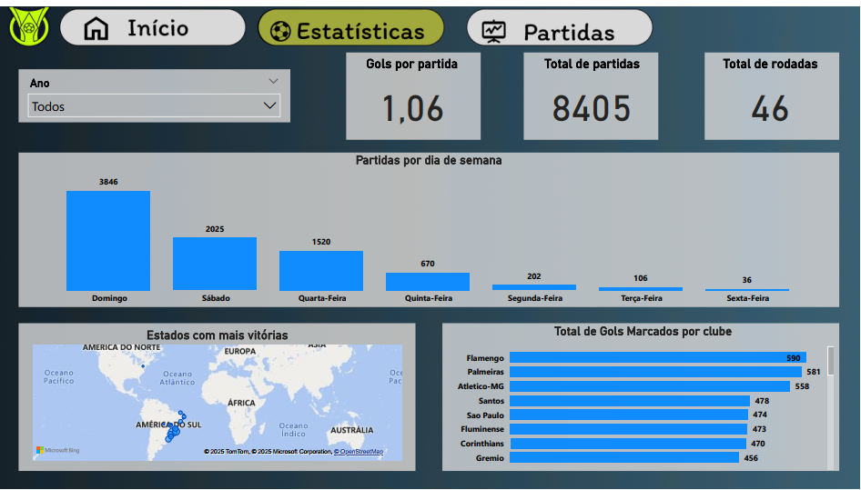

# Projeto: Dashboard Campeonato Brasileiro - Análise de Estatísticas de Futebol

_Coloque aqui uma screenshot pequena e impactante do seu dashboard._

### ➡️ Análise Detalhada e Dashboard Interativo no Meu Portfólio:
[Acesse a página completa do projeto aqui](https://ferreiragabrielw.github.io/portfolio-gabriel/projetos/Dashboards/7DadosCampeonatoBrasileiro/Projeto7DA.html)

---

## Sobre o Projeto

Este dashboard analítico, desenvolvido em **Power BI**, foca nas estatísticas do Campeonato Brasileiro de Futebol. O objetivo é fornecer uma visão abrangente sobre o desempenho de equipes e jogadores, a dinâmica das partidas e tendências ao longo das temporadas. Ele capacita analistas e entusiastas a explorar métricas chave como gols, posse de bola, chutes, artilharia e comportamento de equipes, permitindo uma compreensão aprofundada do campeonato.

## Tecnologias e Processo

* **Ferramentas**: Power BI Desktop (DAX, M), Figma (prototipação e design), CSV (fontes de dados).
* **ETL**: Dados extraídos de quatro arquivos CSV (`cartoes.csv`, `estatisticas.csv`, `full.csv`, `gols.csv`), transformados no Power Query e modelados com relacionamentos complexos.
* **Insights Chave**: Padrões de jogos por dia da semana (predominância de domingos/sábados), ranking histórico de gols por clube (Flamengo, Palmeiras), estatísticas detalhadas de jogo por clube/temporada, e ranking de artilheiros.

## Conteúdo do Repositório

* `data/`: Bases de dados (CSV) utilizadas.
* `powerbi/`: Arquivo `.pbix` do dashboard Power BI.
* `figma/`: Arquivos relacionados ao protótipo e design no Figma.
* `README.md`: Este documento.
* `LICENSE`: Licença do projeto (MIT License).

## Como Visualizar

* **Online**: [Acesse o dashboard publicado no Power BI Service](https://app.powerbi.com/groups/me/reports/54b43cfa-2bb7-40c7-9a38-7749659f650e/ReportSectiondb174d934dc20ebf6e93?experience=power-bi)
* **Localmente**: Faça o download do arquivo `.pbix` na pasta `powerbi/` e abra-o com o Power BI Desktop.

---

### Licença

Este projeto está licenciado sob a [MIT License](LICENSE).